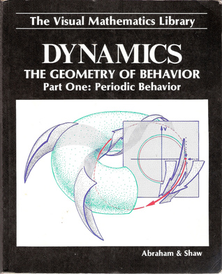

# Dynamics The Geometry Of Behavior

By Ralph H. Abraham

## Book data

[GoodReads ID/URL](https://www.goodreads.com/book/show/869539)

- ISBN: 0942344014
- ISBN13: 9780942344011
- Rating: 5
- Average Rating: 4.42
- Published: 1982
- Publisher: Aerial Press
- Binding: 
- Shelves: mathematics, science
- Shelf: read
- Pages: 220

## See also

- ["Chaos, Gaia, Eros](Chaos__Gaia__Eros-_A_Chaos_Pioneer_Uncovers_the_Three_Great_Streams_of_History.md)
- [Chaos in Discrete Dynamical Systems](Chaos_in_Discrete_Dynamical_Systems-_A_Visual_Introduction_in_2_Dimensions.md)
- ["Dynamics, the Geometry of Behavior](Dynamics__the_Geometry_of_Behavior-_Global_Behavior-Part_3_Visual_Mathematicals_Library.md)
- ["Dynamics, the Geometry of Behavior, Part 2](Dynamics__the_Geometry_of_Behavior__Part_2-_Chaotic_Behavior_Visual_Mathematics_Library.md)
- ["Dynamics, the Geometry of Behavior PT. 4](Dynamics__the_Geometry_of_Behavior_PT_4-_Bifurcation_Behavior.md)
- [Foundations of Mechanics](Foundations_of_Mechanics.md)
