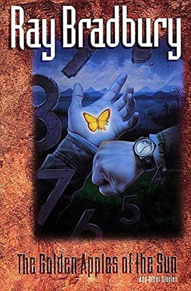

# The Golden Apples of the Sun

By Ray Bradbury

## Book data

[GoodReads ID/URL](https://www.goodreads.com/book/show/50035)

- ISBN: 0380730391
- ISBN13: 9780380730391
- Rating: 5
- Average Rating: 4.07
- Published: 1953
- Publisher: William Morrow
- Binding: Paperback
- Shelves: science-fiction
- Shelf: read
- Pages: 338

## See also

- ["Dandelion Wine (Green Town, #1)"](Dandelion_Wine_Green_Town__1.md)
- [Fahrenheit 451](Fahrenheit_451.md)
- [I Sing the Body Electric! & Other Stories](I_Sing_the_Body_Electric!_and_Other_Stories.md)
- ["Something Wicked This Way Comes (Green Town, #2)"](Something_Wicked_This_Way_Comes_Green_Town__2.md)
- [The Illustrated Man](The_Illustrated_Man.md)
- [The Martian Chronicles](The_Martian_Chronicles.md)
