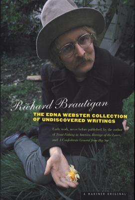

# The Edna Webster Collection of Undiscovered Writing

By Richard Brautigan

## Book data

[GoodReads ID/URL](https://www.goodreads.com/book/show/12573)

- ISBN: 0395974690
- ISBN13: 9780395974698
- Rating: 3
- Average Rating: 3.63
- Published: 1999
- Publisher: Mariner Books
- Binding: Paperback
- Shelves: short-stories, brautigan
- Shelf: read
- Pages: 144

## See also

- [A Confederate General from Big Sur / Dreaming of Babylon / The Hawkline Monster](A_Confederate_General_from_Big_Sur_-_Dreaming_of_Babylon_-_The_Hawkline_Monster.md)
- [A Confederate General from Big Sur](A_Confederate_General_from_Big_Sur.md)
- [An Unfortunate Woman](An_Unfortunate_Woman.md)
- [Dreaming of Babylon](Dreaming_of_Babylon.md)
- [In Watermelon Sugar](In_Watermelon_Sugar.md)
- [Revenge of the Lawn](Revenge_of_the_Lawn.md)
- [Revenge of the Lawn / The Abortion / So the Wind Won't Blow it All Away](Revenge_of_the_Lawn_-_The_Abortion_-_So_the_Wind_Wont_Blow_it_All_Away.md)
- [Rommel Drives on Deep Into Egypt](Rommel_Drives_on_Deep_Into_Egypt.md)
- [Sombrero Fallout](Sombrero_Fallout.md)
- [So the Wind Won't Blow It All Away](So_the_Wind_Wont_Blow_It_All_Away.md)
- [The Abortion](The_Abortion.md)
- [The Hawkline Monster](The_Hawkline_Monster.md)
- [The Pill vs. the Springhill Mine Disaster](The_Pill_vs_the_Springhill_Mine_Disaster.md)
- [Tokyo-Montana Express](Tokyo-Montana_Express.md)
- [Trout Fishing In America](Trout_Fishing_In_America.md)
- [Trout Fishing in America / The Pill vs. the Springhill Mine Disaster / In Watermelon Sugar](Trout_Fishing_in_America_-_The_Pill_vs_the_Springhill_Mine_Disaster_-_In_Watermelon_Sugar.md)
- [Willard and His Bowling Trophies](Willard_and_His_Bowling_Trophies.md)
