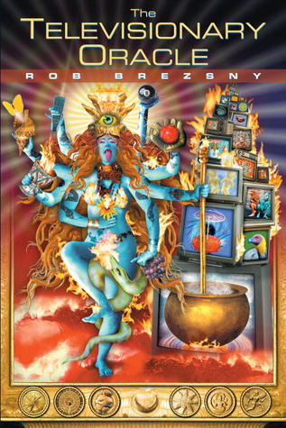

# The Televisionary Oracle

By Rob Brezsny

## Book data

[GoodReads ID/URL](https://www.goodreads.com/book/show/92343)

- ISBN: 1583940006
- ISBN13: 9781583940006
- Rating: 5
- Average Rating: 3.85
- Published: 2000
- Publisher: Frog Books
- Binding: Paperback
- Shelves: philosophy, novels
- Shelf: read
- Pages: 496

## See also

- [Images Are Dangerous](Images_Are_Dangerous.md)
- [Pronoia is the Antidote for Paranoia](Pronoia_is_the_Antidote_for_Paranoia-_How_the_Whole_World_is_Conspiring_to_Shower_You_With_Blessings.md)
