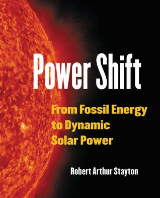

# Power Shift: From Fossil Energy to Dynamic Solar Power

By Robert Arthur Stayton

## Book data

[GoodReads ID/URL](https://www.goodreads.com/book/show/25463452)

- ISBN: 099047920X
- ISBN13: 9780990479208
- Rating: 5
- Average Rating: 4.58
- Published: 2015
- Publisher: Sandstone Publishing
- Binding: Paperback
- Shelves: nonfiction, reference, science
- Shelf: read
- Pages: 346

## Review

"Power Shift" really should be required reading for all. This book clearly and concisely explains the evolution of mankind's use of energy and the role of energy in our rise as dominant species of planet Earth.  Anyone involved in the climate debate or the impact of fossil fuel use on the climate should read this book. Our educators should read this book. In fact, I would recommend everybody read this book.  Don't think that because Stayton provides a clear and concise explanation of the science and evolution of energy use by humans that this book will not inform the scientific community. I have a Ph.D. in Mathematics, a rich history of study in the physical sciences, and a lifelong career as a computer scientist yet every page of this book managed to inform me in ways I had not previously connected.  Read it.

