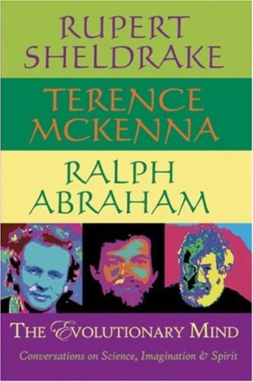

# "The Evolutionary Mind: Conversations on Science, Imagination & Spirit"

By Rupert Sheldrake

## Book data

[GoodReads ID/URL](https://www.goodreads.com/book/show/369075)

- ISBN: 0974935972
- ISBN13: 9780974935973
- Rating: 0
- Average Rating: 4.15
- Published: 1998
- Publisher: Monkfish Book Publishing
- Binding: Paperback
- Shelves: to-read, philosophy, science
- Shelf: to-read
- Pages: 224

## See also

- ["Chaos, Creativity and Cosmic Consciousness"](Chaos__Creativity_and_Cosmic_Consciousness.md)
