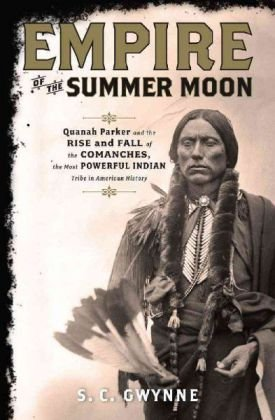

# "Empire of the Summer Moon: Quanah Parker and the Rise and Fall of the Comanches, the Most Powerful Indian Tribe in American History"

By S.C. Gwynne

## Book data

[GoodReads ID/URL](https://www.goodreads.com/book/show/7648269)

- ISBN: 1416591052
- ISBN13: 9781416591054
- Rating: 5
- Average Rating: 4.21
- Published: 2010
- Publisher: Scribner
- Binding: Hardcover
- Shelves: reference, nonfiction, biography
- Shelf: read
- Pages: 371

## Review

This extensively researched history of the Comanche should be required reading for every American. Gwynne manages to transform what could be an exhaustively detailed dry account into a gripping tale of historical scale. Not for the squeamish, Gwynne pulls no punches in his account - a major plus as far as I am concerned as the truth in this chapter should not be edited. The book contains tons of fascinating fact. For instance, did you know that Buffalo Hump (born ca. late 1790s to early 19th century — died 1870) was a Native American War Chief of the Penateka band of the Comanche Indians. His Nʉmʉ tekwapu (Comanche) name, properly transliterated, was Po-cha-na-quar-hip which meant "erection that won't go down" ? Or, that Isa-tai ("Wolf's Vulva" c.1840 — c.1890) was a Comanche warrior and medicine man of the Quahadi band. Originally named Quenatosavit (White Eagle), after the debacle at Adobe Walls he was known as Isa-tai which translates as "wolf's vulva" or "coyote vagina" ?  Gwynne uses the life of Quanah Parker and Quanah's family as his focus to tie the epic saga together and provide a bigger than life character the reader can bond with. The Parker family could have their own book and the story of Quanah Parker is uniquely apropos as a microcosm of the larger story of the Native American tribes. If I could recommend only one book and it couldn't be any Brautigan or Vonnegut or Dick or Steinbeck or Robbins or McMurtry plus it had to be non-fiction then this would be it! :)

