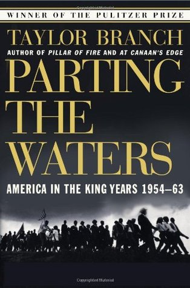

# "Parting the Waters: America in the King Years, 1954-63"

By Taylor Branch

## Book data

[GoodReads ID/URL](https://www.goodreads.com/book/show/414077)

- ISBN: 0671687425
- ISBN13: 9780671687427
- Rating: 5
- Average Rating: 4.35
- Published: 1988
- Publisher: Simon Schuster
- Binding: Paperback
- Shelves: biography, nonfiction
- Shelf: read
- Pages: 1120

## See also

- [At Canaan's Edge](At_Canaans_Edge-_America_in_the_King_Years_1965-68.md)
- [Pillar of Fire](Pillar_of_Fire-_America_in_the_King_Years_1963-65.md)
