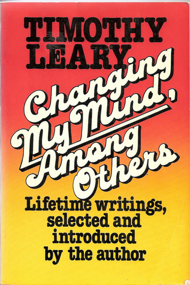

# "Changing My Mind, Among Others: Lifetime Writings"

By Timothy Leary

## Book data

[GoodReads ID/URL](https://www.goodreads.com/book/show/2091583)

- ISBN: 0131278290
- ISBN13: 9780131278295
- Rating: 4
- Average Rating: 3.87
- Published: 1982
- Publisher: Prentice Hall
- Binding: Hardcover
- Shelves: philosophy, leary
- Shelf: read
- Pages: 274

## See also

- [Confessions Of A Hope Fiend](Confessions_Of_A_Hope_Fiend.md)
- [Design For Dying](Design_For_Dying.md)
- [Exo-Psychology](Exo-Psychology-_A_Manual_on_the_Use_of_the_Human_Nervous_System_According_to_the_Instructions_of_the_Manufacturers.md)
- [Flashbacks](Flashbacks.md)
- [Neuropolitique (Revised)](Neuropolitique_Revised.md)
- [The Game of Life](The_Game_of_Life.md)
- [The Intelligence Agents](The_Intelligence_Agents.md)
- [The Politics of Ecstasy](The_Politics_of_Ecstasy.md)
- [The Politics of Psychopharmacology](The_Politics_of_Psychopharmacology.md)
- [The Psychedelic Experience](The_Psychedelic_Experience.md)
- [What Does Woman Want?](What_Does_Woman_Want.md)
