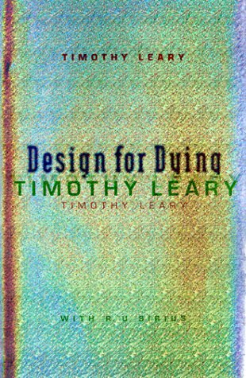

# Design For Dying

By Timothy Leary

## Book data

[GoodReads ID/URL](https://www.goodreads.com/book/show/460053)

- ISBN: 0060928662
- ISBN13: 9780060928667
- Rating: 5
- Average Rating: 3.79
- Published: 1997
- Publisher: HarperOne
- Binding: Paperback
- Shelves: philosophy, leary
- Shelf: read
- Pages: 252

## See also

- ["Changing My Mind, Among Others](Changing_My_Mind__Among_Others-_Lifetime_Writings.md)
- [Confessions Of A Hope Fiend](Confessions_Of_A_Hope_Fiend.md)
- [Exo-Psychology](Exo-Psychology-_A_Manual_on_the_Use_of_the_Human_Nervous_System_According_to_the_Instructions_of_the_Manufacturers.md)
- [Flashbacks](Flashbacks.md)
- [Neuropolitique (Revised)](Neuropolitique_Revised.md)
- [The Game of Life](The_Game_of_Life.md)
- [The Intelligence Agents](The_Intelligence_Agents.md)
- [The Politics of Ecstasy](The_Politics_of_Ecstasy.md)
- [The Politics of Psychopharmacology](The_Politics_of_Psychopharmacology.md)
- [The Psychedelic Experience](The_Psychedelic_Experience.md)
- [What Does Woman Want?](What_Does_Woman_Want.md)
