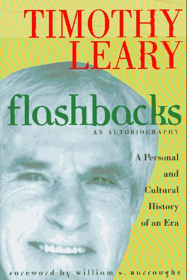

# Flashbacks

By Timothy Leary

## Book data

[GoodReads ID/URL](https://www.goodreads.com/book/show/83491)

- ISBN: 0874778700
- ISBN13: 9780874778700
- Rating: 5
- Average Rating: 4.11
- Published: 1983
- Publisher: Tarcher
- Binding: Paperback
- Shelves: biography, leary
- Shelf: read
- Pages: 405

## See also

- ["Changing My Mind, Among Others](Changing_My_Mind__Among_Others-_Lifetime_Writings.md)
- [Confessions Of A Hope Fiend](Confessions_Of_A_Hope_Fiend.md)
- [Design For Dying](Design_For_Dying.md)
- [Exo-Psychology](Exo-Psychology-_A_Manual_on_the_Use_of_the_Human_Nervous_System_According_to_the_Instructions_of_the_Manufacturers.md)
- [Neuropolitique (Revised)](Neuropolitique_Revised.md)
- [The Game of Life](The_Game_of_Life.md)
- [The Intelligence Agents](The_Intelligence_Agents.md)
- [The Politics of Ecstasy](The_Politics_of_Ecstasy.md)
- [The Politics of Psychopharmacology](The_Politics_of_Psychopharmacology.md)
- [The Psychedelic Experience](The_Psychedelic_Experience.md)
- [What Does Woman Want?](What_Does_Woman_Want.md)
