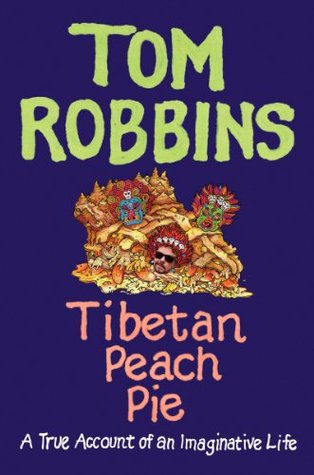

# Tibetan Peach Pie: A True Account of an Imaginative Life

By Tom Robbins

## Book data

[GoodReads ID/URL](https://www.goodreads.com/book/show/18498559)

- ISBN: 006226740X
- ISBN13: 9780062267405
- Rating: 5
- Average Rating: 3.88
- Published: 2014
- Publisher: Ecco
- Binding: Hardcover
- Shelves: robbins, biography
- Shelf: read
- Pages: 384

## Review

I finally got around to reading the Tom Robbins memoir "Tibetan Peach Pie". What a fascinating life! And, as one would expect, Robbins does to memoirs what he previously did to the novel - this is much more than a simple recounting of a remarkable life, he manages to provoke a sense of wonder and awe even in this non-fiction format and continues to dazzle with the brilliance of his prose. Full of great funny provocative stories that reflect on not just the man and his writing but on our culture, consciousness, evolution, place in nature, the cosmic comedy, and everything.  Thanks Tom Robbins!

## See also

- [Another Roadside Attraction](Another_Roadside_Attraction.md)
- [B Is for Beer](B_Is_for_Beer.md)
- [Even Cowgirls Get the Blues](Even_Cowgirls_Get_the_Blues.md)
- [Fierce Invalids Home from Hot Climates](Fierce_Invalids_Home_from_Hot_Climates.md)
- [Half Asleep in Frog Pajamas](Half_Asleep_in_Frog_Pajamas.md)
- [Jitterbug Perfume](Jitterbug_Perfume.md)
- [Skinny Legs and All](Skinny_Legs_and_All.md)
- [Still Life with Woodpecker](Still_Life_with_Woodpecker.md)
- [Villa Incognito](Villa_Incognito.md)
- [Wild Ducks Flying Backward](Wild_Ducks_Flying_Backward.md)
