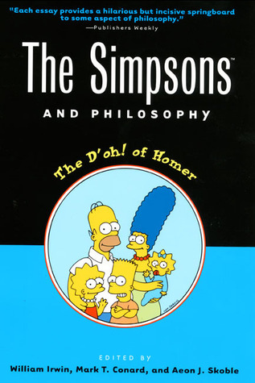

# The Simpsons and Philosophy: The D'oh! of Homer

By William Irwin

## Book data

[GoodReads ID/URL](https://www.goodreads.com/book/show/31813)

- ISBN: 0812694333
- ISBN13: 9780812694338
- Rating: 5
- Average Rating: 3.46
- Published: 2001
- Publisher: Open Court
- Binding: Paperback
- Shelves: philosophy, anthologies
- Shelf: read
- Pages: 303

